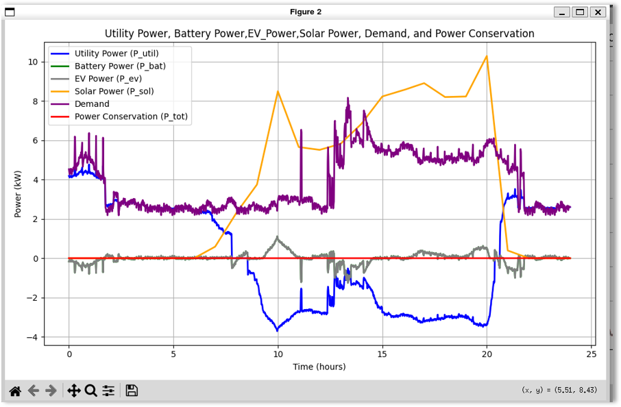
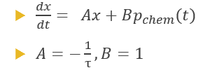

# ⚡ Electric Vehicle Battery Model (EVBM) Optimization

This repository contains the simulation and optimization framework for modeling the electric vehicle (EV) charging cycle, home energy demand, solar generation, and bi-directional battery storage using Python. The workflow progresses from basic static models to refined, real-world optimization using control theory and weather-driven solar data.

---

## 🔍 Project Overview

The primary goal is to simulate and optimize energy flow in a smart residential system integrating:

- 🚗 **Electric Vehicle (EV)**
- 🔋 **Battery Storage System**
- ☀️ **Solar PV Array**
- 🏠 **Home Energy Demand**
- 🔌 **Grid/Utility Power**

---

## 🎯 Project Goals

- Simulate EV and battery SOC under various energy scenarios.
- Integrate real solar data via `pvLib`.
- Implement optimization using `cvxpy` to reduce grid dependency and costs.
- Analyze seasonal effects and energy use behavior.

---

## 📊 Control Volume Diagram

  
*Figure: Power flow between system elements—solar panels, EV, battery, grid, and home.*

---

## 🔁 Iteration Timeline

### 🔹 Iteration 1: Basic Models

- Static home demand and EV charging.
- Dynamic battery SOC modeled in Python.

  
*Figure: Power distribution under basic assumptions with constant demand and EV call.*

---

### 🔹 Iteration 1.1: Utility and Constant Demand

- Grid usage calculated as the gap between charger output and demand.
- SOC limits applied to EV and battery.

**Input Parameters:**

- Home Demand: 8.0 kW  
- EV Call: 5.0 kW  
- EV SOC Range: 0.5 – 0.9  
- Initial Battery SOC: 1.00  

  
*Figure: SOC and power dynamics with constant utility demand.*

---

### 🔹 Iteration 1.2: Solar Integration

- Solar modeled using `pvLib` and NOAA weather datasets.
- Seasonal simulations: Winter, Spring, Summer.

**Input Parameters:**

- Home Demand: 15.0 kW  
- Realistic solar generation using date-specific weather data.

**Seasonal Plots:**

  
*Figure: Winter simulation with low solar output.*

  
*Figure: Spring simulation with moderate solar generation.*

  
*Figure: Summer simulation with peak solar availability.*

---

### 🔹 Iteration 1.3: Optimization Added

- Introduced convex optimization (`cvxpy`).
- Goal: Minimize utility power draw while satisfying EV and battery constraints.

**Control Variables:**  
- `P_bat` – Battery power  
- `P_ev` – EV power

  
*Figure: Optimized energy flows reducing utility dependency.*

---

### 🔹 Iteration 1.4: Varying Demand

- Added temporal variations to home demand and solar output.
- Highlighted issues with excess grid feedback.

**Energy Flow Summary:**

- Grid Supplied: 31.13 kWh  
- Total Demand: 92.71 kWh  
- Solar Generated: 91.70 kWh  
- Fed Back to Grid: 30.19 kWh  

  
*Figure: Overgeneration identified as key inefficiency.*

---

## ⚙️ Iteration 2.0+: Advanced Modeling & Tuning

### 🔹 Iteration 2.1: Refined Battery Models

- Tuned system matrices for battery behavior.
- Improved SOC curve predictions.

  
*Figure: SOC tracking with improved battery model.*

  
*Figure: Battery charge/discharge efficiency refinement.*

---

### 🔹 Iteration 2.2: Objective Function Tuning

- Introduced time-of-use (ToU) cost factors.
- EV plug-in schedule modeled using departure/arrival windows.
- Soft constraints on SOC limits.

**Updated Energy Flow Summary:**

- Grid Supplied: 33.42 kWh  
- Solar Generated: 91.70 kWh  
- Feedback to Grid: 29.81 kWh  

**Graphs:**

  
*Figure: Smoothed power profile after tuning cost-sensitive objective.*

  
*Figure: SOC evolution of EV and battery under optimized constraints.*

  
*Figure: Visual validation of objective behavior.*

---

## 🧠 Technologies Used

- Python 3.x  
- [`cvxpy`](https://www.cvxpy.org/) – convex optimization  
- [`pvLib`](https://pvlib-python.readthedocs.io/) – solar power modeling  
- `numpy`, `pandas`, `matplotlib`

---