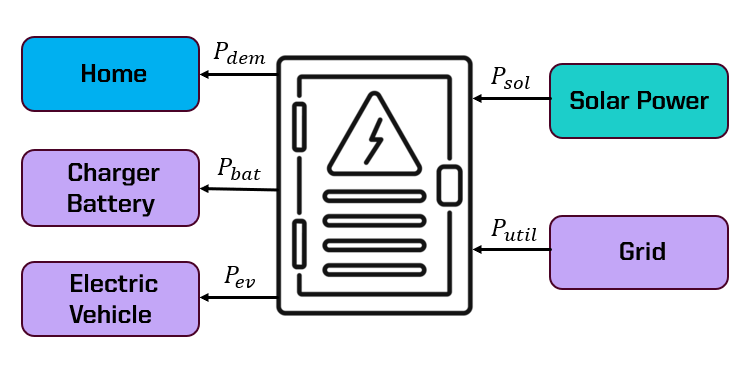
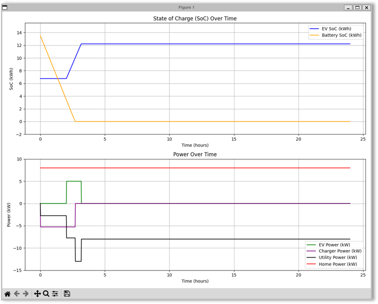
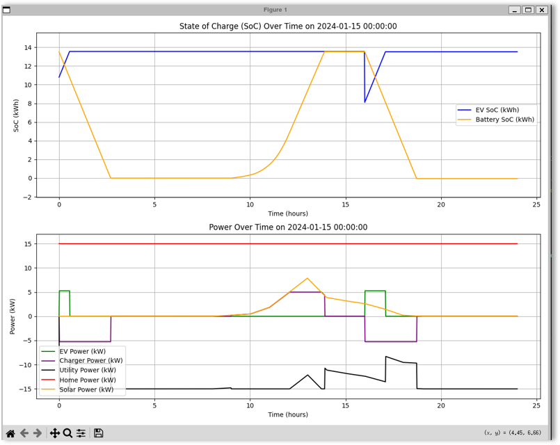
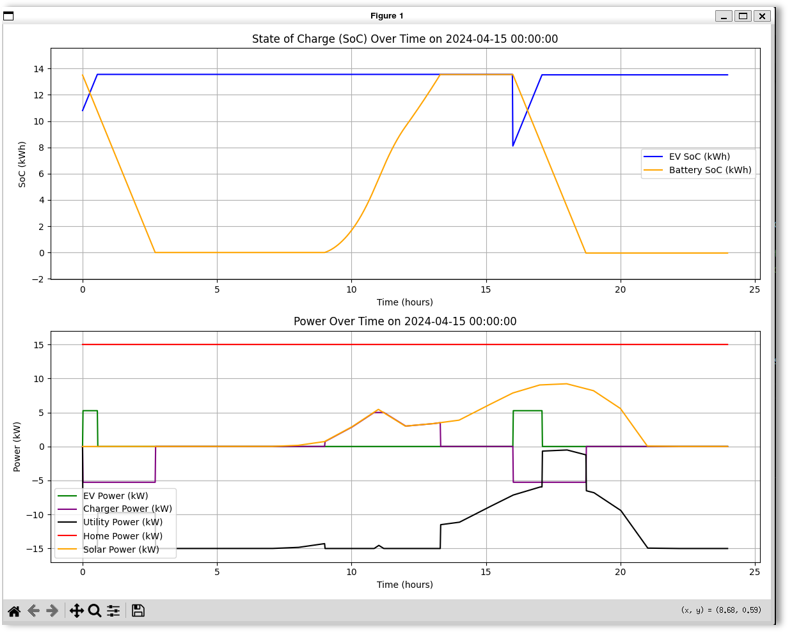
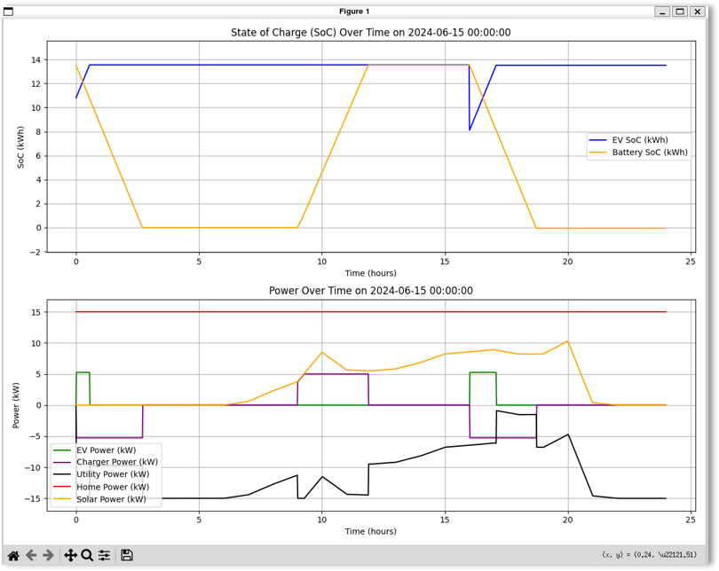
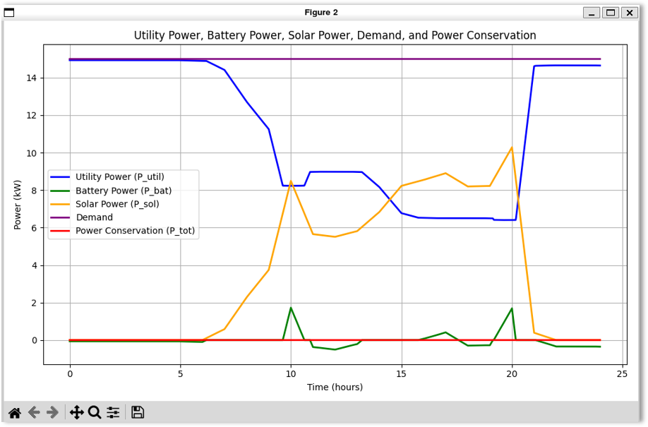
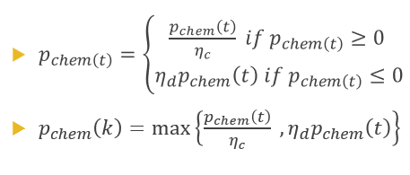

# Electric Vehicle Battery Model (EVBM) Optimization

This repository contains the simulation and optimization framework for modeling the electric vehicle (EV) charging cycle, home energy demand, solar generation, and bi-directional battery storage using Python. It includes a progression of iterations, starting from simple static models to refined dynamic optimization using control theory and solar data integration.

## 🔍 Project Overview

The objective of this project is to simulate and optimize the power flow in a residential setup involving:

- An Electric Vehicle (EV)
- A Battery Storage System
- A Solar PV Array
- Home Demand Load
- Grid/Utility Power

## 📌 Goals

- Develop a dynamic simulation of EV and battery state of charge (SOC).
- Implement solar data using `pvLib`.
- Optimize grid usage via `cvxpy`.
- Validate energy flow and cost-saving effectiveness under seasonal and demand variation.

## 📊 Control Volume Diagram

This control volume illustrates the flow of power between solar panels, the EV, the battery, the grid, and the home.

---

## 📈 Iterations

### Iteration 1: Basic Models
- **Home Demand**: Static
- **EV Call**: Constant at 5 kW
- **Battery SOC**: Dynamic
- 

---

### Iteration 1.1: Add Constant Utility and Demand
- Introduced utility calculation as difference between charger output and total demand.
- Inputs:
  - Home Demand: 8.0 kW
  - EV Call: 5.0 kW
  - SOC EV range: 0.5 - 0.9
  - Initial Charger SOC: 1.00
  - 

---

### Iteration 1.2: Solar Integration
- Added `pvLib` for solar modeling using weather data.
- Seasonal simulation support: Winter, Spring, Summer
- Inputs:
  - Home Demand: 15.0 kW
  - Solar Data: Realistic via `pvLib`
- 
- 
- 

---

### Iteration 1.3: Optimization Added
- Introduced `cvxpy` optimization to minimize utility power.
- Control Variables: Charger Power (`P_bat`), EV Power (`P_ev`)
- Inputs: Demand (`P_dem`), Initial SOCs
- 

---

### Iteration 1.4: Varying Demand
- Added date-specific demand and solar variations.
- Identified issues of excess feedback to the grid.
- Energy Flow Summary:
  - Grid Supplied: 31.13 kWh
  - Home Demand: 92.71 kWh
  - Solar Produced: 91.70 kWh
  - Feedback to Grid: 30.19 kWh
  - 

---

## ⚙️ Iteration 2.0+: Advanced Optimization

### Iteration 2.1: Refined Battery Models
- Tuned battery models and validated with graph plots.
- 
- 

### Iteration 2.2: Objective Function Tuning
- Added Time-of-Use (ToU) cost modeling.
- Introduced constraints for:
  - EV departure/arrival SOC
  - Feedback to grid penalties
  - SOC soft bounds (0.2 – 0.8)
- Updated Energy Flow Summary:
  - Grid Supplied: 33.42 kWh
  - Feedback: 29.81 kWh

- 
- 

- Validated Objective Function with graphs
  - 

---

## 🧠 Technologies Used

- Python 3.x
- `cvxpy` – convex optimization
- `pvLib` – solar modeling
- `numpy`, `pandas`, `matplotlib`

